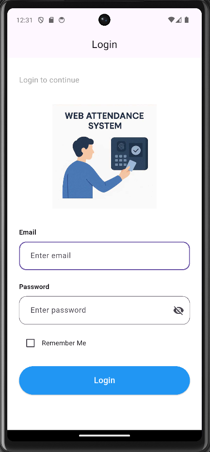
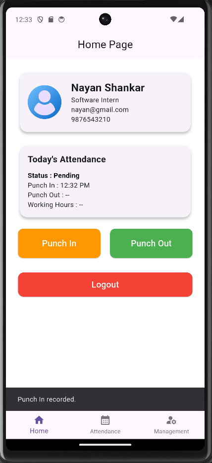
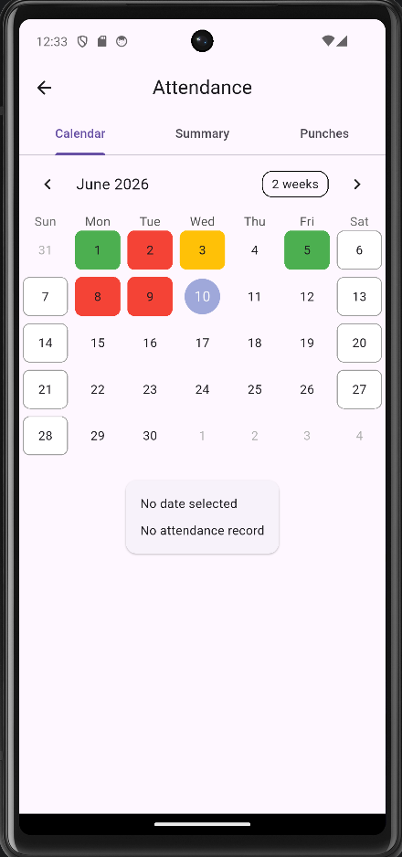
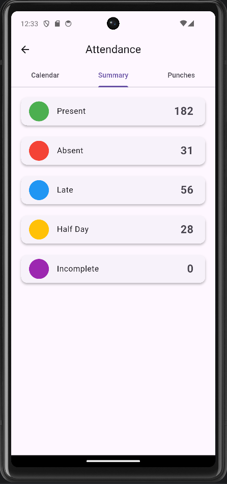
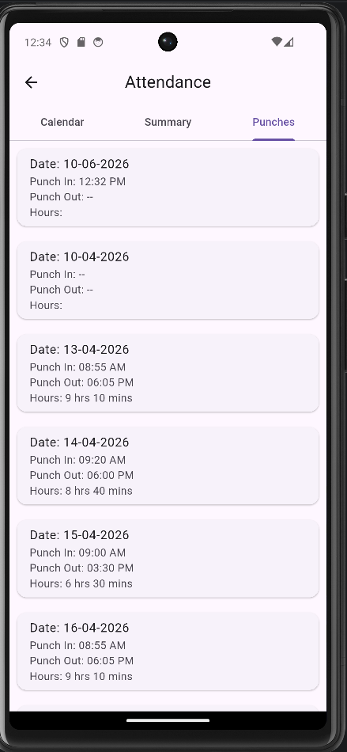
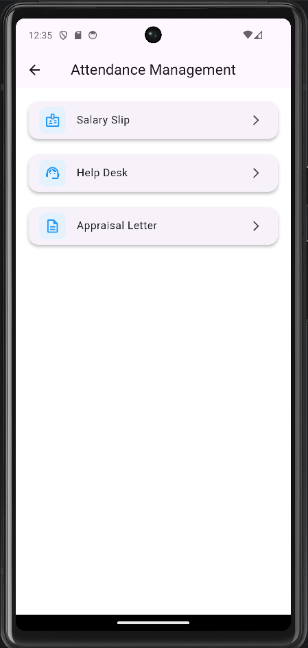

Employee Attendance Management & HRMS System

A Flutter-based Employee Attendance and HRMS application that allows employees to manage attendance records, view attendance analytics, and access HR-related services through a modern mobile interface.

Key Highlights
• Flutter-based mobile application
• SQLite-powered attendance management
• Multi-user attendance tracking
• Calendar-based attendance visualization
• HRMS management module
• Persistent local data storage
________________________________________

Features:
Authentication
•	Login using employee credentials 
•	JSON-based user authentication 
•	Remember Me functionality 
•	Auto-login using SharedPreferences 
•	Secure logout 
Attendance Management
•	Punch In functionality 
•	Punch Out functionality 
•	Working hours calculation 
•	Attendance status calculation 
Attendance Statuses
•	Present 
•	Late 
•	Half Day 
•	Absent 
•	Incomplete 
Attendance Dashboard
•	Employee Profile Card 
•	Today's Attendance Status 
•	Punch In Time 
•	Punch Out Time 
•	Working Hours Display 
Attendance Module
•	Calendar View 
•	Attendance Summary 
•	Punch Records History 
Calendar Features
•	Date-wise attendance tracking 
•	Attendance color visualization 
•	Attendance details on date selection 
Attendance Summary
•	Present Count 
•	Late Count 
•	Half Day Count 
•	Absent Count 
•	Incomplete Count 
Management Module
•	Salary Slip 
•	Help Desk 
•	Appraisal Letter 
Database
•	SQLite Local Database 
•	Multi-user attendance management 
•	Persistent attendance storage 
________________________________________

Project Statistics:
• 8+ Screens Developed
• SQLite Database Integration
• 5 Attendance Status Types
• Calendar-based Attendance Tracking
• Multi-user Support
________________________________________

Screenshots:

## Login Screen

## Home Dashboard

## Attendance Calendar

## Attendance Summary

## Punch Records

## Management Module

 	 	 	 
________________________________________
:
Tech Stack
Frontend
•	Flutter 
•	Dart 
Local Storage
•	SQLite (sqflite) 
State Management
•	StatefulWidget 
•	setState() 
Packages Used
sqflite
path
shared_preferences
table_calendar
intl
________________________________________

Project Structure:
lib
│
├── database
│   └── database_helper.dart
│
├── screens
│   ├── login_screen.dart
│   ├── home_screen.dart
│   ├── attendance_screen.dart
│   ├── management_screen.dart
│   ├── salary_slip_screen.dart
│   ├── help_desk_screen.dart
│   └── appraisal_screen.dart
│
├── main.dart
│
assets
│
├── data
│   └── users.json
│
├── images
│   └── logo.jpg										                     
│   └── user.png
________________________________________

Attendance Workflow:
Login
    ↓
Home Dashboard
    ↓
Punch In
    ↓
SQLite Database
    ↓
Punch Out
    ↓
Working Hours Calculation
    ↓
Attendance Status Calculation
    ↓
Calendar / Summary / Punch Records
________________________________________

Attendance Logic:
Present: Working Hours >= 8
Late: Punch In after 09:05 AM
Half Day: Working Hours < 8 OR Punch Out before 04:55 PM
Absent: Working Hours < 6
Incomplete: Employee forgot to Punch Out after Punch In
________________________________________

How to Run: 
Clone repository: git clone <repository-url>
Move into project: cd attendance_app
Install dependencies: flutter pub get
Run application: flutter run
________________________________________

Future Enhancements:
•	Firebase Authentication 
•	Cloud Firestore Integration 
•	Leave Management System 
•	Employee Notifications 
•	Attendance Export Reports 
•	Admin Dashboard 
•	Biometric Authentication 
________________________________________

Learning Outcomes:
Through this project, I gained hands-on experience with:
•	Flutter UI Development 
•	SQLite Database Integration 
•	JSON Parsing 
•	SharedPreferences 
•	State Management 
•	Navigation & Routing 
•	Attendance Management Logic 
•	Calendar Integration 
•	Multi-screen Mobile Application Development 
________________________________________

Author,
Nayan Shankar Gupta
B.Tech CSE (VIT Vellore)

